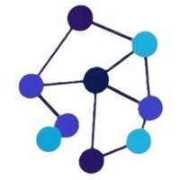

<!-- NeuroBrain README.md -->
<!-- Replace logo.png and demo.gif with your assets in the repo (or use remote URLs) -->

  <!-- Hero section using inline HTML (GitHub supports this) -->
  
  <h1 style="margin:8px 0 0 0;">NeuroBrain</h1>
  

    <strong>AI Agent for Businesses</strong>
  

  <!-- Quick badges -->
  

    
    
    
  

  <!-- Demo GIF (optional) -->
  <!--

    
  
-->

---

# What is NeuroBrain?

**NeuroBrain** builds human-grade AI agents and voice assistants for businesses that need 24/7 intelligent automation, customer support, and workflow orchestration.

We design, develop, and deploy production-ready conversational AI that understands your customers and automates repetitive tasks — from lead qualification and booking to billing and knowledge retrieval.

---

## Core tagline
> **AI Agent for Businesses**

---

## Highlights

- ✅ Production-ready conversational and voice agents  
- ✅ Rich integrations: CRMs & Telephony
- ✅ Secure and scalable deployment (cloud and on-prem options)  
- ✅ Custom workflows, RAG (Retrieval Augmented Generation), and advanced routing  
- ✅ Monitoring, analytics, and human takeover

---

## Features

- **24/7 Conversational Assistant** — Answer questions, qualify leads, schedule meetings.
- **Voice & Chat Channels** — Web chat, WhatsApp, Telegram, IVR and SIP integrations.
- **Knowledge-Base + RAG** — Connect your docs, FAQs, and ticket history for accurate answers.
- **Automation Flows** — Build rule-based & AI-driven automations for common tasks.
- **Human Handoff** — Smoothly route complex issues to human agents.
- **Secure by Design** — Role-based access, logging, and audit trails.

---
